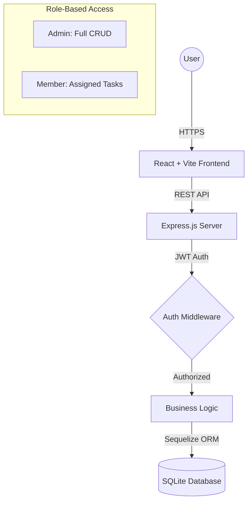

# ⚡ TaskFlow — Team Task Manager (Full-Stack)

[](https://railway.app)
[](https://reactjs.org/)
[](https://nodejs.org/)

TaskFlow is a premium, high-performance **Team Task Management** system built to streamline collaboration. It features a sophisticated dark glassmorphism UI, real-time analytics, and robust role-based access control (RBAC).

---

## 🏗️ System Architecture



---

## ✨ Features

### 💎 Premium Experience
- **Dark Glassmorphism**: A sleek, translucent UI design with vibrant gradients and smooth micro-animations.
- **Responsive Layout**: Seamless experience across mobile, tablet, and desktop.
- **Dynamic Dashboards**: Live data visualization using **Recharts** (Pie charts for status, Bar charts for priority).

### 🛡️ Secure & Scalable
- **JWT Authentication**: Secure login/signup with stateless token management.
- **RBAC**: Multi-level access (Admin vs. Member) to protect sensitive project data.
- **SQL Database**: Powered by Sequelize ORM for reliable data relationships.

### 📋 Task Management
- **Kanban Board**: Drag-and-drop style interaction to move tasks through the pipeline.
- **Project Progress**: Visual progress bars for every project based on task completion.
- **Overdue Alerts**: Automatic detection and highlighting of past-due tasks.

---

## 🛠️ Technology Stack

- **Frontend**: React 18, Vite, React Router v6, Recharts, Axios, React Hot Toast.
- **Backend**: Node.js, Express.js, Sequelize, bcryptjs.
- **Database**: SQLite (No-config, production-ready on Railway).
- **Tooling**: Concurrently (for local dev), Git, Mermaid.js.

---

## 🚀 Quick Start

### 1. Installation
From the root directory:
```bash
npm run install-all
```

### 2. Run Locally
```bash
npm run dev
```
- **Frontend**: `http://localhost:5173`
- **Backend**: `http://localhost:5000`

### 3. Demo Credentials
| Role | Email | Password |
| :--- | :--- | :--- |
| **Admin** | `admin@demo.com` | `admin123` |
| **Member** | `jane@demo.com` | `member123` |

---

## ☁️ Deployment (Railway)

1. **Push** this code to your GitHub.
2. **Link** the repository to a new Railway project.
3. **Environment Variables**:
   - `NODE_ENV`: `production`
   - `JWT_SECRET`: `your_secure_secret`
   - `PORT`: `5000`
4. Railway will automatically build the frontend and serve it through the backend!

---
Built with ⚡ by **Antigravity AI** for Aditya.
