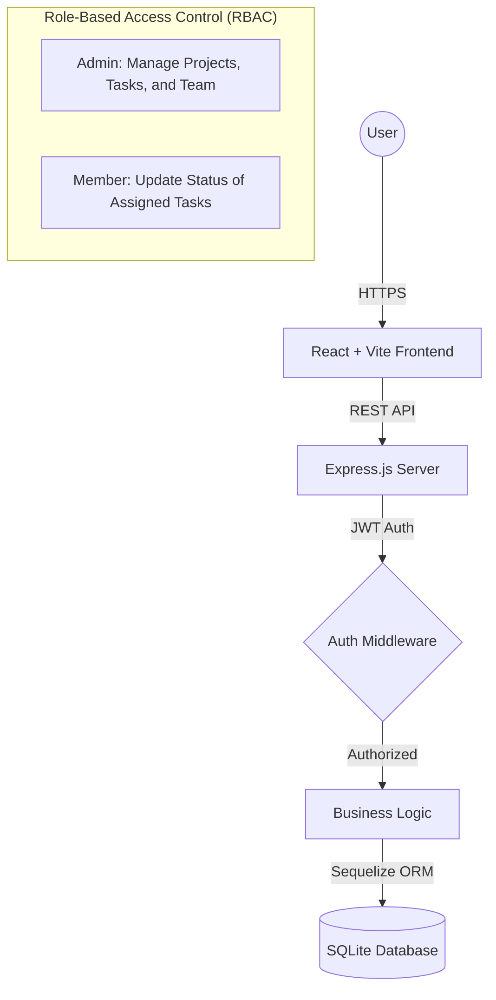

# ⚡ TaskFlow — Team Task Manager (Full-Stack)

[](https://railway.app)
[](https://reactjs.org/)
[](https://nodejs.org/)

TaskFlow is a professional-grade **Team Task Management** platform designed to centralize workspace collaboration. It combines a high-fidelity visual experience with powerful administrative controls to ensure projects stay on track and teams remain productive.

---

## 🏗️ System Architecture & Workflow

TaskFlow follows a modern decoupled architecture, ensuring scalability and ease of deployment.



### Key Workflow:
1.  **Project Creation**: Admins initialize projects and define deadlines.
2.  **Team Assignment**: Admins add registered users to specific projects.
3.  **Task Delegation**: Tasks are created within projects and assigned to specific members.
4.  **Progress Tracking**: Members update task status via the Kanban board, which automatically updates the project's real-time progress bar.

---

## ✨ Deep Feature Set

### 💎 Next-Gen Visual Interface
- **Dark Glassmorphism**: Utilizes CSS backdrop-filters and subtle gradients to create a depth-heavy, tactical "Command Center" aesthetic.
- **Micro-Animations**: Smooth transitions between pages and state updates (e.g., status changes) enhance user engagement.
- **Responsive Dashboard**: A mobile-first approach ensures that team leads can check progress from any device.

### 🛡️ Administrative & Security Features
- **JWT-Based Authentication**: Implements secure, stateless authentication using JSON Web Tokens. Passwords are never stored in plain text, utilizing **bcryptjs** for industrial-strength hashing.
- **Granular RBAC**: 
    - **Admins** have absolute authority (Full CRUD on all entities).
    - **Members** have restricted views, ensuring they focus on their specific responsibilities without compromising project structure.
- **Relational Data Integrity**: Uses Sequelize associations to maintain strict relationships between Users, Projects, and Tasks.

### 📋 Advanced Task Management
- **Interactive Kanban Board**: A dedicated board view allows for rapid status shifting (Todo → In Progress → Done).
- **Automated Analytics**: The dashboard automatically calculates:
    - Task status distribution (Pie Chart).
    - Priority-based workload (Bar Chart).
    - Recent activity feed.
    - Critical alerts for overdue tasks.

---

## 🛠️ Technology Stack & Rationale

-   **Frontend**: `React 18` for component-based UI, `Vite` for lightning-fast builds, and `Recharts` for high-performance data visualization.
-   **Backend**: `Node.js` & `Express.js` for a lightweight, scalable REST API.
-   **Database**: `SQLite` via `Sequelize ORM`. Chosen for its zero-configuration requirement, making it perfect for rapid deployment while maintaining standard SQL features.
-   **Styling**: `Vanilla CSS` with modern CSS Variables (Custom Properties) to ensure maximum performance and no dependency bloat.

---

## 🚀 Getting Started

### 1. Installation
Clone the repo and install all dependencies for both frontend and backend:
```bash
npm run install-all
```

### 2. Local Development
Start the development environment (concurrently runs both servers):
```bash
npm run dev
```
-   **Web UI**: `http://localhost:5173`
-   **API Endpoint**: `http://localhost:5000`

### 3. Demo Accounts
| Role | Email | Password |
| :--- | :--- | :--- |
| **Admin** | `admin@demo.com` | `admin123` |
| **Member** | `jane@demo.com` | `member123` |

---

## ☁️ Deployment Strategy

The application is optimized for **Railway** deployment. The root `package.json` includes a `deploy-prep` script that automates the build process.

1.  Connect this GitHub repository to Railway.
2.  Set `NODE_ENV` to `production`.
3.  Set a secure `JWT_SECRET`.
4.  The backend is configured to serve the production build of the frontend automatically.

---
**Project Repository**: [TaskFlow Team Manager](https://github.com/aditya29625/team-task-manager)
